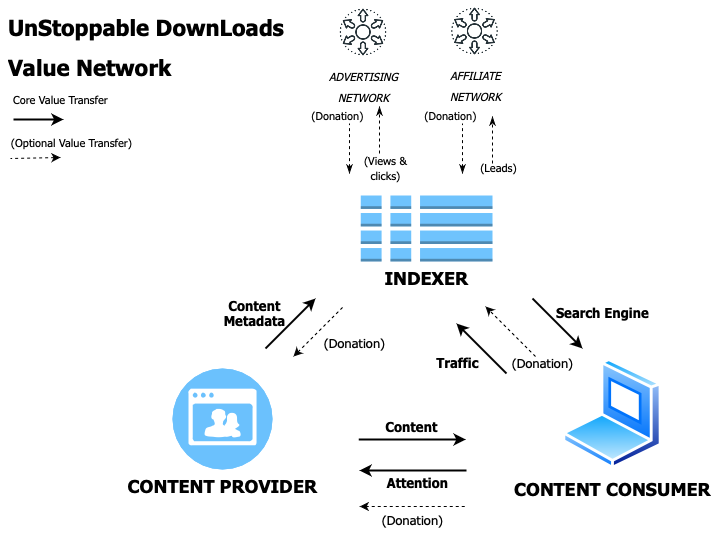
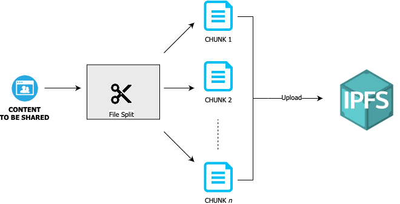

# USDL - UnStoppable DownLoads 

USDL is a censorship-resistant content sharing infrastructure built on iExec and IPFS. 

Our goal is to empower individuals with an unstoppable right to share any artifacts with their community. This is achieved with decentralization and cryptography. 
Ultimately, this empowerment means that everyone bears the sole responsibility of what they share for the good or bad of the community. 

## Contents
- [USDL - UnStoppable DownLoads](#usdl---unstoppable-downloads)
  - [Contents](#contents)
  - [Economics](#economics)
    - [The value network](#the-value-network)
    - [Content Providers](#content-providers)
    - [Indexers](#indexers)
    - [Content Consumers](#content-consumers)
  - [Data Model](#data-model)
    - [Metadata](#metadata)
    - [FileChunk](#filechunk)
  - [Unstoppable architecture](#unstoppable-architecture)
    - [Current topology](#current-topology)
    - [Way forward](#way-forward)
    - [Alternative way forward](#alternative-way-forward)
  - [Workflows](#workflows)
    - [Content publishing workflow](#content-publishing-workflow)
    - [Content indexing workflow](#content-indexing-workflow)
    - [Content consuming workflow](#content-consuming-workflow)

---

## Economics
We believe that a service like USDL is viable only if it serves a sustainable economic model, based on transfers of value between  network participants.

### The value network
We distinguish 3 main network participants : Content Providers, Indexers, Content Consumers. The diagram below illustrates how the value flows within USDL's ecosystem.

### Content Providers
The value they bring to the network is the content they created or acquired. 
Content Providers have the option to directly sell their content's metadata (see data model section) to Indexers. 
Monetization is achieved by using iExec's marketplace built-in governance rules where datasets can be sold in exchange of $RLC (iExec's marketplace utility token)

### Indexers
The value they bring to Content Consumers is the aggregated searchable index of content. 

Indexers can choose to incentivize Content Providers i.e. buying metadata datasets on iExec's marketplace. 

Also, Indexers have the option to implement their own conditional access their index should they want to maximize XXXXXXXX 

- Content Consumer must have at least x $RLC in their wallet
- Content Consumer must own a given NFT 
- Content Consumer must be a Content Provider too
- ...

### Content Consumers
The value they bring to the network is their attention (traffic) that Indexers can monetize from Advertising or Affiliate platforms. 
Optionaly, they can choose to donate to Content Providers 

## Data Model

### Metadata 
This data structure holds the information that is necessary for indexing. 

| Property | Type | Description |
| ------ | ------ | ------ |
| title | string | File's title | 
| fileName | string | Actual file name | 
| uid | string | File unique identifier | 
| fileSize | number | file size in bytes | 
| chunks | Array Of FileChunk | Array of file chunks metadata | 
| hash | string | Hash of the file contents | 
| imdb | string | IMDB id (applicable to Movies and Series) | 
| imdb_starring | string | Actors / Cast (applicable to Movies and Series) |
| imdb_year | string | Year of release (applicable to Movies and Series)  |
| category | string | Indexing category for the file | 
| description | string | File description | 

### FileChunk
Files are splitted across multiple chunks. `FileChunk` is the data structure that holds each chunk's metadata.

| Property | Type | Description |
| ------ | ------ | ------ |
| cid | string | IPFS Content Identifier of the file part |
| size | Number | Size of the file part |
| checksum | number | Checksum |
| sequence | number | sequence number of this file part |
| byteBegin | number | Starting byte index of this chunk |
| byteEnd | number | Ending byte index of this chunk |

## Unstoppable architecture

### Current topology

### Way forward 

### Alternative way forward

## Workflows

### Content publishing workflow

### Content indexing workflow

The indexer NodeJS program has a dual functionality : 
- Metadata database
- IPFS node

This way the indexing workflow happens in 5 steps

#### Step 1: fetching dataset orders
The indexing service fetches all the iExec dataset orders published by the uploaders for the USDL app. By doing this, the indexing service gets all the files uploaded on UDSL. For each dataset order, if a deal has been found for indexer's wallet address as a requester, it means that the file has already been indexed in the service's Metadata. In that case, the second step is skipped.

#### Step 2: matching orders
For each dataset order found, a new request order is created, signed and published in the marketplace, with the indexer's local wallet address as a requester. The request order is then matched with each of the dataset orders. From this matching, a deal will be generated which means the indexer will be able to access the resultof its task, in this case the details of the file to index.

#### Step 3: fetch tasks results
Each task result contains the IPFS chunks of the file to index. The results of the tasks started at the time of their respective deals will be decrypted by the app, before being added to the local database if is not already in it.

#### Step 4: verify chunks' availability
The Metadata DB is a object of chunks. The CIDs are only added to IPFS when the uploader uploads a file. That's why, given the principle of IPFS, they may not be available at anytime and it is important to make sure the CID's are available at anytime so that the dowloads stay unstoppable. Therefore, for each chunk in the metadata DB, the indexer shall verify if it is available on IPFS. If they are step 5 is skipped.

#### Step 5: pin chunks' CIDs
The metadata chunks CID are pinned to the indexer IPFS local node so that the chunks can be available on IPFS at anytime. That way, the files can be downloaded **unstoppably**.

### Content consuming workflow

[def]: #usdl---unstoppable-downloads